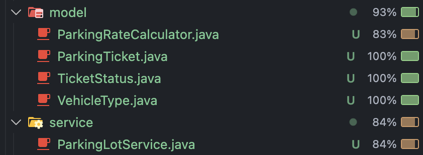

# Sistema de Gestión de Estacionamiento (Parking System) 🅿️

Aplicación de consola (CLI) para la gestión y cobro de tarifas de estacionamiento. Este proyecto ha sido desarrollado en **Java 21** utilizando **Maven**, aplicando principios de **Diseño Orientado a Objetos** y metodología **TDD (Test Driven Development)**.

## Descripción del Diseño
El sistema se basa en una **Arquitectura en Capas** para asegurar la separación de responsabilidades:

1.  **Capa de Presentación (`ParkingApp`):** Maneja la interacción con el usuario (entradas/salidas) y validaciones básicas de formato.
2.  **Capa de Servicio (`ParkingLotService`):** Orquestador del sistema. Mantiene el estado de los tickets en memoria y coordina las operaciones.
3.  **Capa de Dominio (`ParkingRateCalculator`, `ParkingTicket`):** Contiene las reglas de negocio (tarifas, topes, descuentos) y las entidades de datos.

### Diagrama de Clases (UML)


## Instrucciones de Ejecución
### Prerrequisitos

| Herramienta | Versión Requerida |
| :--- | :--- |
| **Java JDK** | 21 o superior |
| **Apache Maven** | 3.6 o superior |

### 1. Compilar el proyecto
Sitúate en la raíz del proyecto y ejecuta el siguiente comando para limpiar y empaquetar la solución:

```bash
mvn clean package
```


### 2. Ejecutar la aplicación
Una vez generado el artefacto (cuando veas el mensaje BUILD SUCCESS), inicia el programa con:

```bash
java -cp target/parking-calculator-1.0-SNAPSHOT.jar parking.app.ParkingApp
```

## Ejecución de Pruebas (Tests)
Este proyecto incluye una suite de pruebas automatizadas con JUnit 5 para validar las reglas de negocio.

Para ejecutar todas las pruebas y verificar la cobertura:
```bash
mvn test
```

**Salida esperada:**
```bash
[INFO] Tests run: 16, Failures: 0, Errors: 0, Skipped: 0
[INFO] BUILD SUCCESS
```

## Detalle de la Suite de Pruebas 🧪
El proyecto cuenta con una cobertura de pruebas unitarias (JUnit 5) dividida en tres capas principales para asegurar la calidad del software:

### 1. Pruebas de Lógica de Negocio (`ParkingRateCalculatorTest`)
Responsable de validar que las matemáticas, tarifas y reglas de negocio sean exactas.

1.  **Cálculo tarifa Moto (1 bloque):** Verifica que una moto estacionada 30 min pague exactamente **$500**.
2.  **Cálculo tarifa Camioneta (1 bloque):** Verifica que una camioneta estacionada 30 min pague exactamente **$1.000**.
3.  **Redondeo de Bloques (Auto):** Valida que si se excede el tiempo (ej. 31 min) se cobren 2 bloques completos (**$1.600**).
4.  **Descuento Fin de Semana:** Comprueba la aplicación automática del **10% de descuento** si el ingreso es Sábado o Domingo.
5.  **Aplicación de Tope Diario:** Asegura que el cobro nunca supere el tope de **$15.000**, incluso tras 24 horas.
6.  **Tope Diario con Descuento:** Valida el caso borde donde aplican ambas reglas ($15.000 - 10% = **$13.500**).
7.  **Validación de Duración Cero:** Lanza excepción si la hora de entrada es igual a la de salida.

### 2. Pruebas de Servicio y Flujo (`ParkingLotServiceTest`)
Responsable de coordinar la persistencia y el flujo de entrada/salida.

1.  **Registro de Entrada:** Valida la creación de un Ticket con estado `OPEN` y ID único.
2.  **Registro de Salida:** Verifica el flujo completo: cambio a `CLOSED`, cálculo de precio y guardado de hora de salida.
3.  **Salida de Ticket Inexistente:** Asegura que se lance error al intentar procesar un ID no registrado.
4.  **Salida de Ticket Ya Cerrado:** Lanza `IllegalStateException` si se intenta cobrar un ticket ya pagado (evita cobro doble).
5.  **Cálculo de Total Diario:** Verifica que la recaudación sume solo los tickets `CLOSED` con fecha de salida **hoy**.
6.  **Listado de Tickets:** Comprueba que el servicio separe correctamente los vehículos estacionados de los históricos.

### 3. Pruebas de Modelo (`ParkingTicketTest`)
Responsable de validar la integridad del objeto Ticket.

1.  **Creación de Ticket:** Verifica que un ticket nuevo inicie con monto `null` y estado `OPEN`.
2.  **Cierre Manual:** Valida la actualización correcta de atributos (fecha fin y monto) al ejecutar el cierre.
3.  **Protección de Inmutabilidad:** Asegura que lance una excepción si se intenta modificar un ticket que ya está `CLOSED`.


### Resultados de la Ejecución

A continuación se muestra la salida de la consola tras ejecutar las pruebas unitarias y el reporte de cobertura con Maven:

```bash
$ mvn clean test jacoco:report

[INFO] -------------------------------------------------------
[INFO]  T E S T S
[INFO] -------------------------------------------------------
[INFO] Running parking.ParkingLotServiceTest
[INFO] Tests run: 6, Failures: 0, Errors: 0, Skipped: 0
[INFO] 
[INFO] Running parking.ParkingTicketTest
[INFO] Tests run: 3, Failures: 0, Errors: 0, Skipped: 0
[INFO] 
[INFO] Running parking.ParkingRateCalculatorTest
[INFO] Tests run: 6, Failures: 0, Errors: 0, Skipped: 0
[INFO] 
[INFO] Results:
[INFO] Tests run: 15, Failures: 0, Errors: 0, Skipped: 0
[INFO] 
[INFO] --- jacoco:0.8.10:report (report) @ parking-calculator ---
[INFO] Analyzed bundle 'parking-calculator' with 6 classes
[INFO] ------------------------------------------------------------------------
[INFO] BUILD SUCCESS
[INFO] ------------------------------------------------------------------------
[INFO] Total time:  2.089 s
[INFO] ------------------------------------------------------------------------
```

## Reporte de Cobertura
Herramienta utilizada: VS Code Java Test Runner (Motor JaCoCo).

Para este proyecto, he priorizado la Cobertura de Ramas (Branch Coverage) sobre la simple cobertura de líneas. Esta decisión estratégica se debe a que el núcleo del dominio (ParkingRateCalculator) concentra reglas de negocio basadas en condiciones complejas —como la aplicación de topes diarios o descuentos de fin de semana—; por consiguiente, era indispensable validar matemáticamente cada bifurcación lógica (if/else) tanto en sus caminos verdaderos como falsos, asegurando así la robustez del cálculo de tarifas y la ausencia de código muerto en la capa de servicio.

A continuación, se presenta una imagen con el porcentaje de cobertura de cada archivo:



## Licencia
Este proyecto se distribuye bajo la licencia **MIT**. Consulta el archivo [LICENSE](LICENSE) para más detalles.